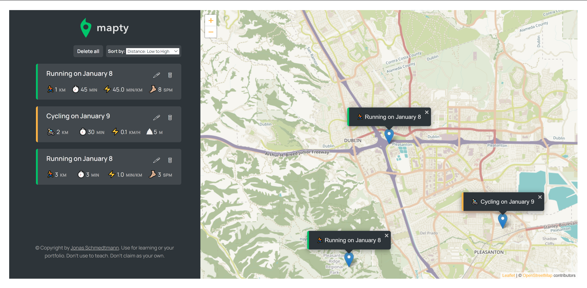

# Mapty Project

Web application that allows users to keep track of their workout logs.

# Motivation

I worked on this project when I took the course [The Complete Javascript Course 2022](https://www.udemy.com/course/the-complete-javascript-course/) taught by instructor Jonas Schmedtmann. Since I found this project interesting, I kept working on it and added more features including:

- Editing each workout log
- Deleting selected workout log or delete all of them
- Sorting workout logs based on date, distance or duration

# Built With

- Bootstrap
- Leaflet

# Screenshots

